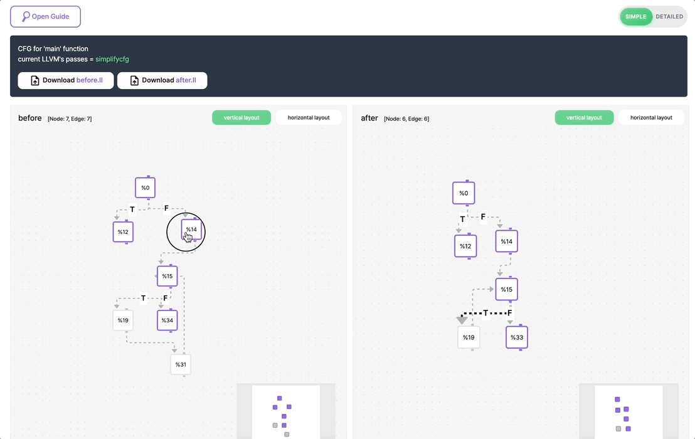

  

## Visualize the LLVM CFG interactively !

<b>LLVM-FLOW</b> is an open-source project that interactively visualizes [LLVM IR CFG](https://flang.llvm.org/docs/ControlFlowGraph.html).
You can easily compare CFG before and after optimization in <b>LLVM-FLOW</b> page.

👉 [visit LLVM-FLOW](https://llvmflow.kc-ml2.com/)

## ✅ What You can do

1. Detect the same Basic Block between IR modules
2. Switch the mode of CFG
3. Switch modes only for certain nodes
4. Move the node
5. Find the target&source node of the edge
6. Resize the `div`
7. Change the direction of CFG
8. Zoom in / Zoom out
9. Download `.ll` files
10. Guide for LLVM-FLOW

## ✅ Contribution

- Please make a new branch instead of the current basic branch (ex. main) and work on it.
- If there is an additional commit after the review, please proceed with the `Re-request` review!
